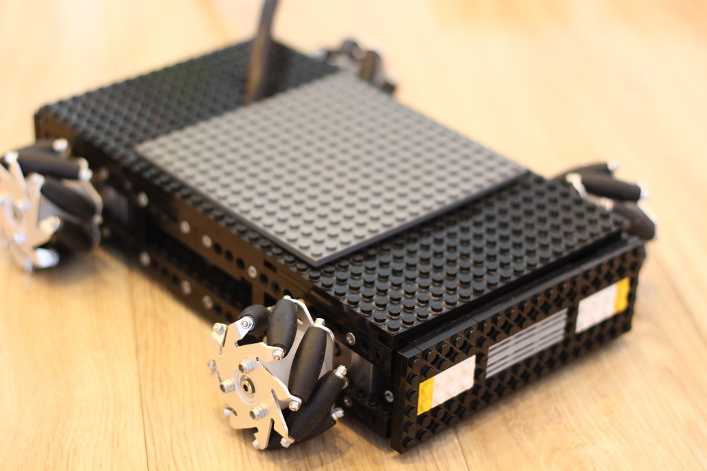

# *A*utomatic *G*uided *V*ehicle (AGV) with Mecanum wheels
----------

Mecanum wheels consist of free rollers mounted at 45 degrees with respect to the wheel axis. Each wheel is individually controlled by its own electric motor, normally a simple DC motor. This configuration allows the vehicle to move along any direction and any orientation from any given point.

As in the case of any other robot, the control system for the AGV is based on two models: the kinematic and the dynamic model. The first links the spatial velocity of the vehicle with the rotational speed of its wheels. The second considers the forces acting on the vehicle and generates set torques for the wheels.

In this simple implementation we only consider the kinematic model and leave the dynamic model for a future addition.

**Kinematic model**
-----------

The kinematic model for the AGV is a velocity based transformation between the vehicle coordinate system and the wheels coordinate system.

While developing the model we set the following basic assumptions:

 - The movement only happens on a horizontal plane so that all wheels are in contact with the surface at all times.
 - No slipping or sliding happens between the wheels and the surface. This assumption is not very realistic and causes most of the tracking errors depending on the surface of movement. An external tracking device (e.g. laser guide) can be added for higher quality tracking.
 - No friction at contact point. This assumption is clearly an approximation, since motion only happens through friction. However, friction forces can be taken into account in the dynamic model, if required.
 - All four wheels have the same radius R and are placed at symmetrical distance (Dx,Dy) from the center of the vehicle as shown in the drawing below. This assumption simplifies the mathematical notation and is satisfied by the vast majority of practical applications.

The direct and inverse transformations are described in the pdf document and implemented in the *AGVKinDirect.c* and *AGVKinInverse.c* respectively.

